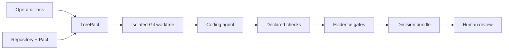

<h1 align="center">TreePact</h1>

<p align="center"><strong>Local, verifiable change control for coding agents.</strong></p>

<p align="center">
  <em>Evidence before merge.</em>
</p>

<p align="center">
  <a href="https://github.com/JesusMonjeGonzalez/treepact/releases/tag/v0.2.0"></a>
  
  
  
  
  
</p>

---

## Status

The recorded M1-M9 candidate completed a nine-stage verification campaign and
received a **go** verdict for an internal pilot. The v0.2.0 source release adds
the strict, read-only `review` contract used by Hearthia and other local
integrations. The project suite (`uv run pytest tests`) contains 183 passing
tests and the current tree passes ruff and mypy; no new nine-stage campaign has
been claimed for this post-M9 addition.

The internal pilot data and operator-specific runbooks are intentionally not
part of this repository.

## Why

Coding agents are fast, confident, and cheap — and they are not reliable. When
you delegate a task to one, you currently have to trust its own summary of what
it did, or rebuild every step by hand: inspect the diff, rerun the tests, check
that no forbidden path was touched, and verify nothing was published, merged,
or exfiltrated.

TreePact turns that supervision into an auditable process. It runs the agent
inside an isolated Git worktree, constrains what it can do with a declarative
**Pact**, executes the repository's declared checks itself, and returns a
**decision bundle** — a cryptographically chained record of facts, not claims.

TreePact is **not** a coding agent, an IDE, a CI/CD platform, a sandbox, or a
proof that generated code is correct. It is the verification layer between an
agent's output and your repository.

## How it works



1. A repository declares an executable **Pact**: which checks exist, which
   paths are writable, which commands are forbidden, and what the agent may
   never do.
2. TreePact creates a **detached worktree** and runs the agent within the Pact
   — no shell, no network egress, no publication actions, no secrets in the
   environment.
3. TreePact executes the declared checks itself (the agent never runs them) and
   evaluates **gates from captured facts**: required checks passed, no denied
   paths changed, no secrets in the diff, worktree consistency, and complete
   evidence.
4. The outcome is a decision — **accepted**, **rejected**, or
   **needs_review** — with an append-only event chain (SHA-256) that you can
   verify independently. The agent never merges anything; you do.

## Quick start

```bash
# Requirements: Python 3.12, uv (https://docs.astral.sh/uv)
uv sync
uv run treepact --help

# Create a Pact draft for a repository and validate it
cd your-repo
uv run --project /path/to/TreePact treepact init
uv run --project /path/to/TreePact treepact validate

# Point TreePact at a local OpenAI-compatible model gateway (loopback only).
# First run `treepact config show` to see the platform-specific config path.
# On macOS the default is ~/Library/Application Support/TreePact/config.toml.
# [provider]
# endpoint = "http://127.0.0.1:9292/v1"
# profiles = { classify = "fast-model", fast-code = "code-model", deep-code = "deep-model" }

# Run a bounded task
uv run --project /path/to/TreePact treepact run "Fix the failing unit test" \
  --repo your-repo --mode repair --runtime native

# Review the evidence
treepact status <run-id>
treepact diff <run-id>
treepact evidence <run-id>
treepact verify <run-id> --check-artifacts --check-events

# Strict read-only JSON for Hearthia and other local integrations
treepact review --schema-version 1 --limit 20
treepact review --schema-version 1 --run-id run_<32-lowercase-hex>
```

Without a provider, `validate` and `observe` still work; `repair` fails
explicitly. There is never a silent fallback.

## Standalone product, optional Hearthia surface

TreePact remains an independent product: its CLI, package, configuration,
SQLite state, worktrees, evidence formats and release cycle do not depend on
Hearthia. It works with any supported loopback OpenAI-compatible provider.

When both products are installed, Hearthia provides a human-operated surface:

```bash
hearth treepact doctor --repo your-repo
hearth treepact validate --repo your-repo
hearth treepact run "Fix the failing unit test" \
  --repo your-repo --mode repair
hearth treepact status RUN_ID
hearth treepact diff RUN_ID
hearth treepact evidence RUN_ID --verify-hashes
hearth treepact verify RUN_ID
```

Hearthia manages local model availability and unified-memory budgets. The
commands delegate policy, worktree isolation, checks, gates and evidence to the
version-pinned TreePact executable. Hearthia parses only the version-pinned
`treepact review` JSON contract and does not open TreePact's database itself.
TreePact opens that database with SQLite `mode=ro` and `query_only`; review
never migrates, discovers runs, recalculates gates, generates bundles, or
writes files. Hearthia does not expose mutable TreePact operations through MCP. See
`docs/integrations/INTEGRATION_STRATEGY.md`.

## Core concepts

| Concept | Description |
|---|---|
| **Pact** | Executable contract in `.treepact.yaml`: checks, writable/denied paths, limits, modes. Strict schema, canonical form, SHA-256 pinned. |
| **Worktree** | Detached Git worktree under TreePact's data directory. The repository checkout is never touched. |
| **Checks** | Declared commands (e.g. `pytest`, `cargo test`) executed by TreePact with a fixed argv and environment. |
| **Gates** | Decisions derived from captured facts: `required_checks_pass`, `no_denied_paths_changed`, `no_secrets_in_diff`, `worktree_consistent`, `evidence_complete`. |
| **Decision bundle** | `report.json` manifest + `diff.patch` + artifact hashes + event chain head. Exportable, verifiable offline. |
| **Modes** | `observe` (diagnose without changes), `repair` (edit inside the Pact), `validate` (Pact only). |

## CLI

```text
init  validate  run  status  runs  review  projects  logs  diff  evidence
cancel  resume  cleanup  verify  eval  config  provider
```

`run` exit codes are stable and documented: `0` accepted, `15` no provider or
invalid runtime, `16` rejected, `17` needs_review, `18` cancelled, `20`
internal failure.

## Security model

- **Loopback-only provider**: the model gateway must be on localhost. Remote
  endpoints are rejected; there is no egress path for model traffic.
- **No shell**: every command runs with a fixed argv; the agent can never write
  a command string.
- **Sanitized environment**: child processes get an allowlisted environment, a
  temporary `HOME`, no `SSH_AUTH_SOCK`, and no token/key/cloud variables.
- **No publication actions**: commit, push, merge, publish, and network are
  not available actions. The Pact denies them by construction.
- **Secret detection**: heuristic scan of every diff for credentials and
  sensitive patterns.
- **Honest boundaries**: checks run with user authority (`trusted_harness`),
  not in a sandbox; secret detection is heuristic; one run at a time.

## Verification

TreePact was built under a strict verification policy (ADR-0011): every
milestone's exit gate means *implemented-unverified* until a single consolidated
campaign ran against a frozen candidate. The recorded final campaign passed all
nine stages:

- 170 tests: unit, property-based, integration, security, recovery, resources,
  and evaluation suites
- Static analysis: ruff, mypy, pip-audit, schema and migration inventories
- Cross-runtime parity: the same Pact, checks, and decision in the native and
  external-agent runtimes
- Full requirement-to-test traceability with a defect register

The historical campaign counted 170 tests. The current source suite adds 13
tests for the read-only review contract; verification fixtures are kept outside
the explicit `pytest tests` command.

See `verification/FINAL_REPORT.md` and `verification/DEFECT_REGISTER.md`.
Known honest limitations: evaluations run on synthetic fixtures (real
repositories are an internal pilot), the external runtime is integration-level
(TP2), and the frozen candidate is identified by tree digest rather than a Git
commit.

## Roadmap

- **M10 — Internal pilot**: real tasks, real repositories, 6 weeks; measures
  supervision reduction, false acceptance rate, and blocked actions.
- **M11 candidates** (separate decisions): daemon, editor extension, native
  clients, relaxed patch formats for faster loops.

## License

MIT — see [LICENSE](LICENSE).
